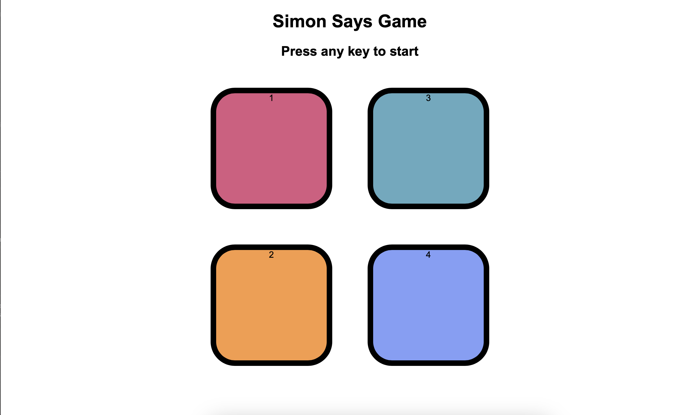
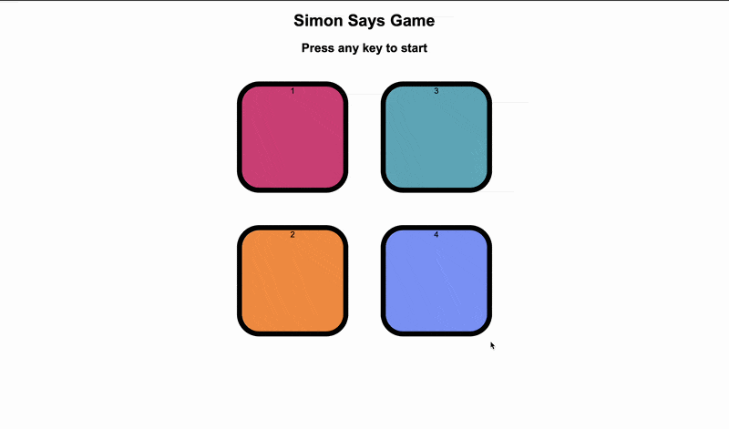

# 🎮 Simon Says Game

<div align="center">

A classic **Simon Says memory game** built with **HTML, CSS, and JavaScript**. Watch the sequence of flashing colors, then repeat it back — each round adds one more step, and the game keeps going until you make a mistake.

<p>
  <a href="https://simon-says-game-amir.netlify.app/"><strong>🌐 Live Demo (Netlify)</strong></a> •
  <a href="https://mohamad-amir.github.io/simon-say-game/"><strong>GitHub Pages</strong></a> •
  <a href="https://github.com/mohamad-amir/simon-say-game"><strong>Repository</strong></a>
</p>

</div>

---

## 📸 Preview

<p align="center">
  
</p>

---

## 🎥 Demo

<p align="center">
  
</p>

---

## 📖 About the Project

The **Simon Says Game** is a frontend recreation of the classic electronic memory game. The computer plays a growing sequence of colored flashes, and the player has to click the buttons in the exact same order. One wrong click ends the game and shows your final score (the level you reached).

This project was built to strengthen my understanding of **JavaScript**, **DOM events**, and **game state management** while building a small, self-contained interactive game from scratch.

---

## ✨ Features

- 🎮 Classic Simon Says gameplay
- 🎨 Four-color interactive button grid
- ✨ Smooth flash animations
- 🔀 Random sequence generation
- ✅ Real-time answer validation
- 🏆 Score tracking by level
- 🔁 Instant game restart after game over
- ⌨️ Press any key to start
- 📱 Responsive design

---

## 🛠️ Tech Stack

| Technology | Purpose |
|------------|---------|
| HTML5 | Structure |
| CSS3 | Styling, Layout & Animations |
| JavaScript (ES6) | Game Logic |
| DOM Events | Keyboard & Click Input |

---

## 📂 Project Structure

```text
simon-say-game/
│
├── assets/
│   ├── demo.gif
│   └── preview.png
│
├── index.html
├── style.css
├── app.js
├── README.md
├── LICENSE
└── .gitignore
```

---

## 🕹️ How to Play

1. Press any key to start the game.
2. Watch which button flashes.
3. Click the buttons in the same order.
4. Each level adds one more color to the sequence.
5. Make a wrong move, and the game ends — your score is the level you reached.
6. Press any key to try again!

---

## 📚 What I Learned

Working on this project improved my understanding of:

- Managing game state with plain JavaScript variables
- Generating and storing a growing random sequence
- Comparing user input against expected input step-by-step
- DOM manipulation and event listeners (`keypress`, `click`)
- Using `setTimeout` to control timing and animations

---

## 🚧 Challenges

Some of the challenges I encountered while building this project included:

- Keeping the computer's sequence and the player's input in sync without race conditions.
- Timing the flash animation so it feels responsive but not too fast to follow.
- Designing clean game-over and reset logic that doesn't leave stale state behind.

---

## 🔮 Future Improvements

- 🔊 Sound effects for each color
- 🎵 Background music
- 🎯 Strict Mode
- 📈 High score saved with `localStorage`
- 🎚️ Difficulty levels (faster flashes, more colors)
- 📱 Better mobile/touch support
- 🌙 Dark mode

---

## 👨‍💻 Author

**Mohammad Amir**

- GitHub: https://github.com/mohamad-amir
- LinkedIn: https://www.linkedin.com/in/amirmuhammed/

---

<div align="center">

### ⭐ If you like this project, consider giving it a star!

</div>
